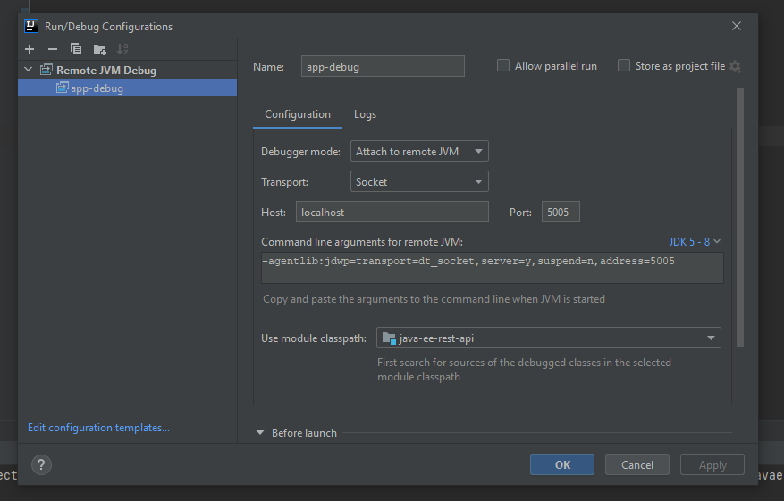

# Java EE 7, JAX-RS starter project

### To run the application, run:
```
mvn clean package tomee:run
```

### To debug the application, run 
```
mvn clean package tomee:run
```

Also, create a remote debugging profile as following:


Then you can start debugging your application.

